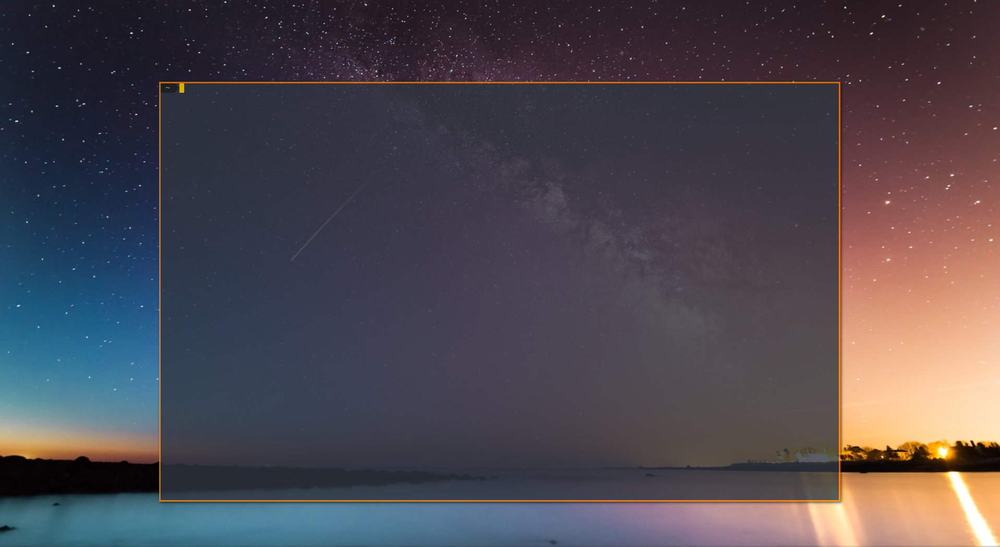
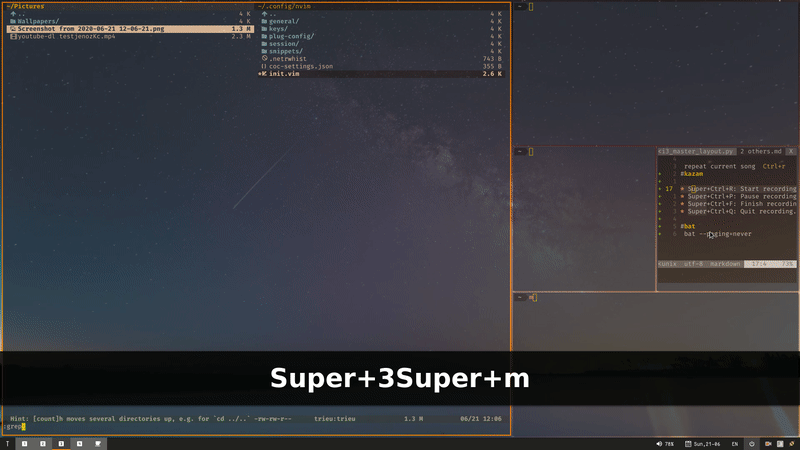
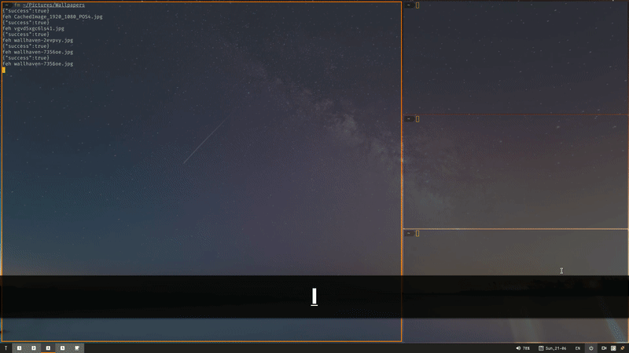

# FEATURE

 master and stack layout in i3
```
| ------ | ----- |
|        |       |
| Master | Stack |
|        |       |
| ------ | ----- |
```

* implement master and stack layout like dwm in i3

* open first terminal in floating mode and default position 
    > you don't need to open the first terminal full screen.
    > It will better if the terminal is display floating center on your screen
    > when you open another window it will change to tilling mode .

    
* swap from any window to master with shorcut `$mod+m`
* move from any window to master with shorcut `$mod+shift+m`

    

* swallow instance 
    > this version is focus on i3 master and it is different to another swallow version 
    > because it will try to restore the original position when you move the swallow instance

    
# Dependencies

1. python3
2. [i3ipc-python](https://github.com/altdesktop/i3ipc-python)
3. xdotool
4. xprop
5. xdo 


# Install

 Install python 3 and install i3ipc libary

 `pip3 install i3ipc`

 Install xdotool xprop and xdo

 download this script and put it to your i3 config folder and run

```bash
cd ~/.config/i3/

git clone https://github.com/windwp/i3-master-stack.git

```
## Run with i3

 put it to your i3 config

```bash
 exec --no-startup-id  $HOME/.config/i3/i3-master-stack/i3_master
 # swap to master node
 bindsym $mod+m nop swap master 
 # go to master node
 bindsym $mod+shift+m nop go master 
 # enable/disable master layout in current workspace
 bindsym $mod+alt+m nop master toggle 

 ```
 reload i3 and testing layout

## Run from terminal
```bash
cd ~/.config/i3/i3-master-stack
python3 ./i3_master_layout.py
 ```
 you can run it use bash file [i3_master](./i3_master)
```bash
 ./i3_master
 ```

# Config

run script first and it will create a config file 

`$HOME/.config/i3/i3_master.ini`

``` ini
[config]
terminal = 'Alacritty'
screenWidth = 1300
screenHeight = 800
posX = 310
posY = 160
swallow = true

; different size between master and slave (unit : ppt)
masterSizePlus = 14  

; new instance on master will change to master
slaveStack = true  
```

> Note:  Use `xdotool selectwindow getwindowgeometry`  change size and get a good postion on floating window


# File manager with swallow 

 if your file manager is not working with the swallow function. You need to add scripts. 
 >Example vifm
 * Copy file [swallow](./swallow) to folder `$HOME/.config/vifm/scripts/`.
 * Edit /vifmrc 
    ```
    filextype *.bmp,*.jpg,*.jpeg,*.png,*.gif,*.xpm
            \ {View in feh}
            \ swallow feh %f,
            \ {View in gpicview}
            \ gpicview %c,
            \ {View in shotwell}
            \ shotwell,
    ```
# TODO

- [ ] Swallow when stack have 1 instance is bad

- [ ]  Swallow use xprop and xdotool is slow.

